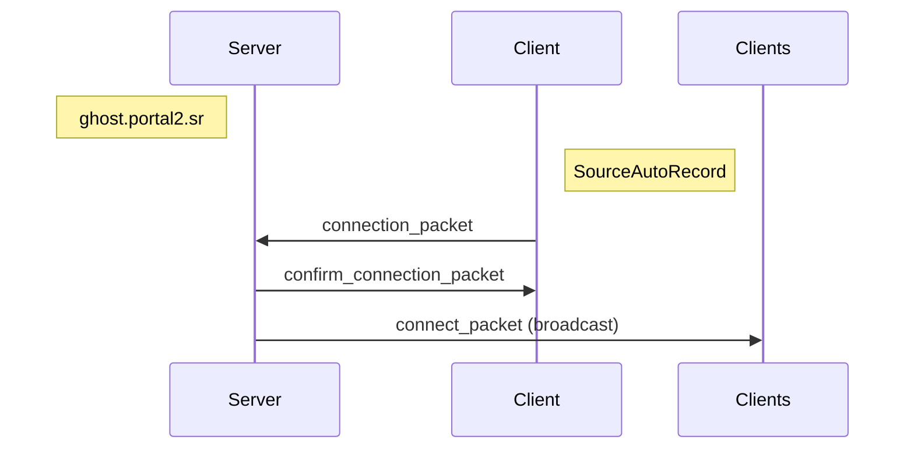
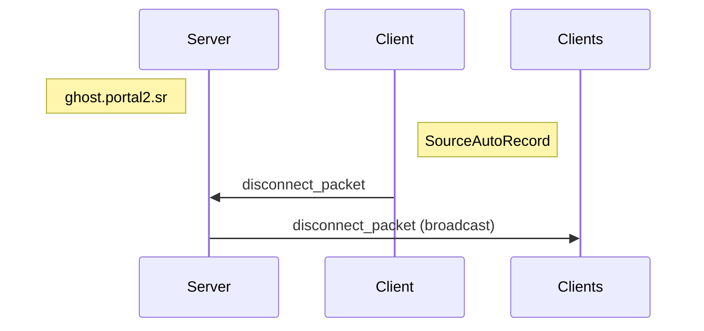
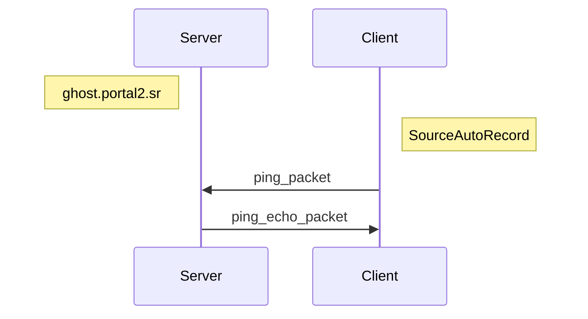
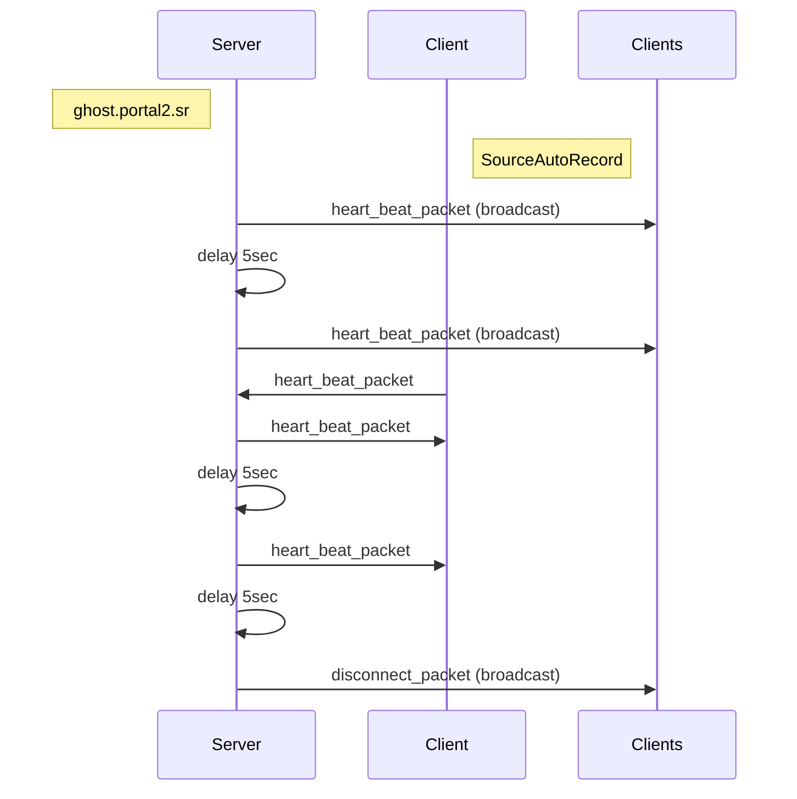
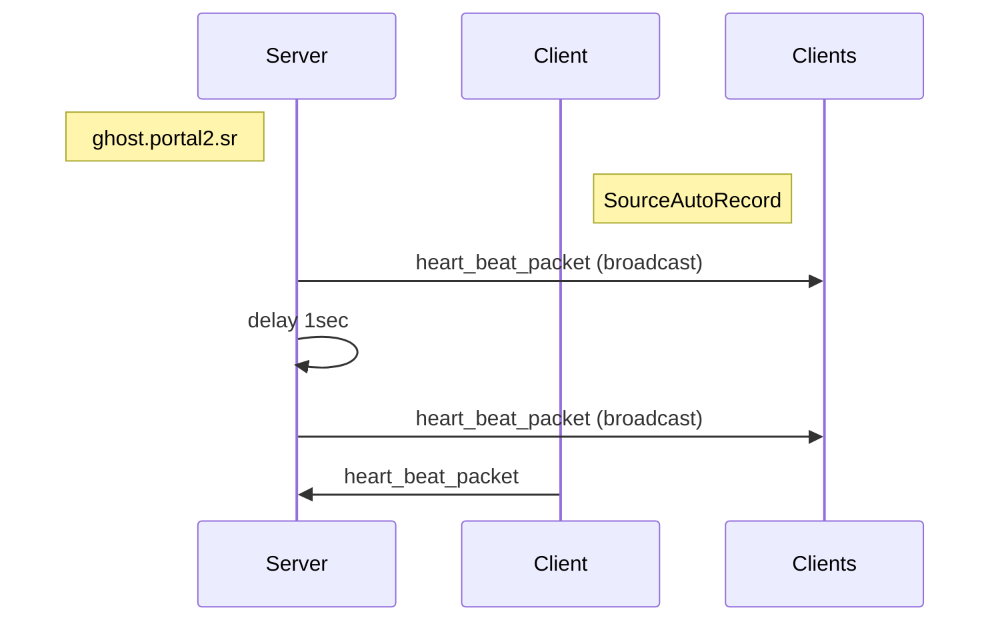
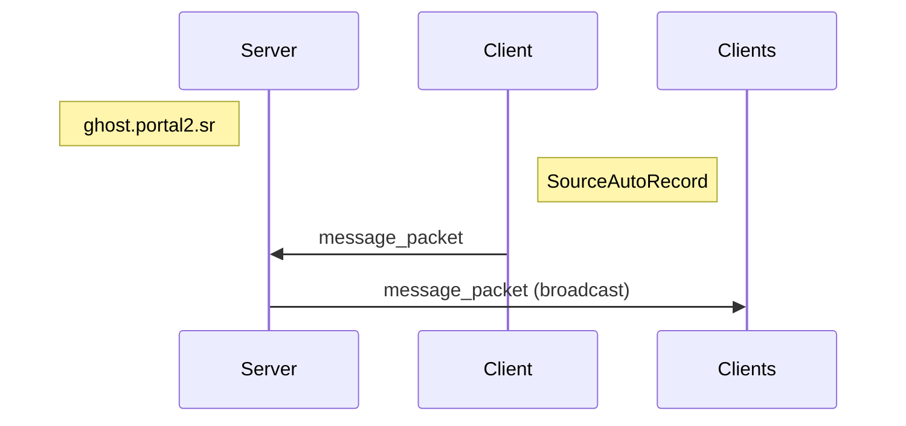
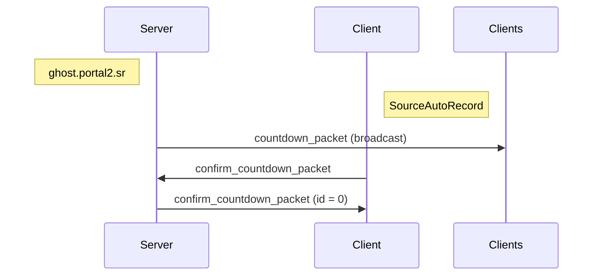
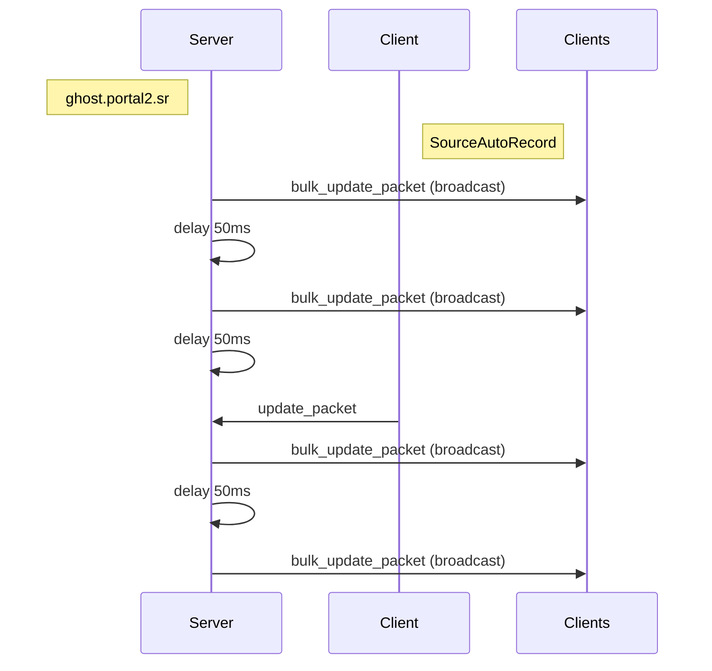
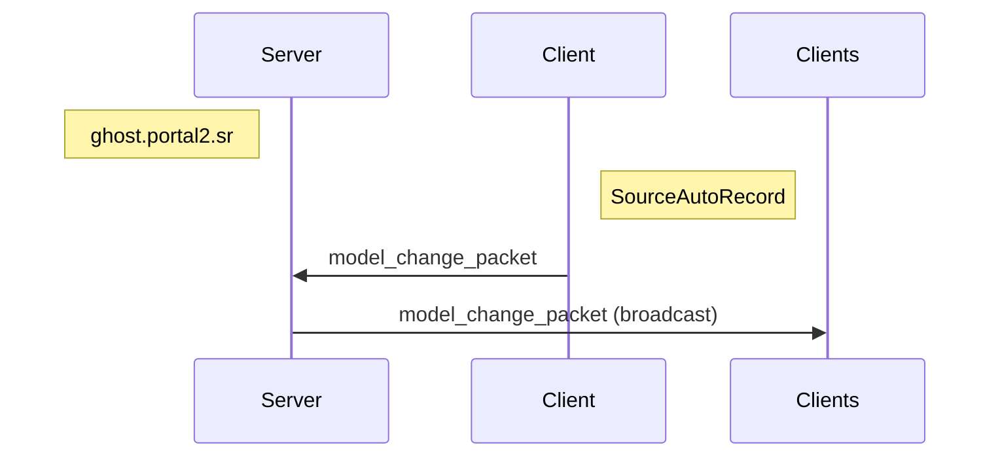
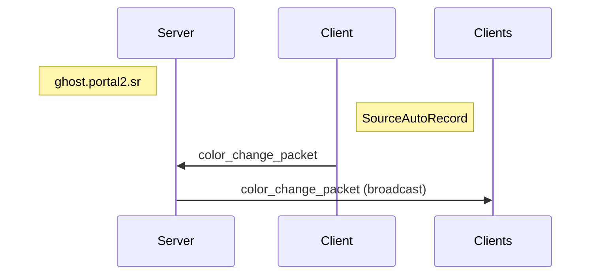

# ghosting

[GhostServer][p2sr-GhostServer] alternative for SourceAutoRecord.

[p2sr-GhostServer]: https://github.com/p2sr/GhostServer

- [Status](#status)
- [Protocol](#protocol)
  - [Header](#header)
  - [Connect](#connect)
  - [Disconnect](#connect)
  - [Ping](#ping)
  - [Map Change](#map_change)
  - [Heart Beat](#heart-beat)
  - [Message](#message)
  - [Countdown](#countdown)
  - [Update](#update)
  - [Speedrun Finish](#speedrun-finish)
  - [Model Change](#model-change)
  - [Color Change](#color-change)
  - [Structs](#structs)
    - [GhostEntity](#ghostentity)
    - [Color](#color)
    - [Vector](#vector)
    - [DataGhost](#dataghost)
    - [DataGhostUpdate](#dataghostupdate)
- [License](#license)

## Status

### TODO

- [x] Protocol
  - [x] Ping
  - [x] Connect
  - [x] Disconnect
  - [ ] Stop Server
  - [x] Map Change
  - [x] Heart Beat
  - [x] Message
  - [x] Countdown
  - [x] Update
  - [x] Speedrun Finish
  - [x] Model Change
  - [x] Color Change
- [x] TCP/UDP mode
- [ ] Implement all server commands
- [ ] Testing
  - [ ] Client + GhostServer
  - [ ] Server + SourceAutoRecord
- [ ] Resolve points below

### Notes/Nitpicks/Unresolved

- ID is not a unique identifier
- Header value gets ignored when starting a connection
- Questionable `STOP_SERVER` implementation
- Disconnect is checked by IP
- Time in `SPEEDRUN_FINISH` is formatted and send as string
- Heart Beat instead of Heartbeat

## Protocol

### Header

| Name                                | Value |
| ----------------------------------- | ----- |
| NONE                                | 0     |
| [PING](#ping)                       | 1     |
| [CONNECT](#connect)                 | 2     |
| [DISCONNECT](#disconnect)           | 3     |
| STOP_SERVER                         | 4     |
| [MAP_CHANGE](#map-change)           | 5     |
| [HEART_BEAT](#heart-beat)           | 6     |
| [MESSAGE](#message)                 | 7     |
| [COUNTDOWN](#countdown)             | 8     |
| [UPDATE](#update)                   | 9     |
| [SPEEDRUN_FINISH](#speedrun-finish) | 10    |
| [MODEL_CHANGE](#model-change)       | 11    |
| [COLOR_CHANGE](#color-change)       | 12    |

### Connect

#### connection_packet

| Field             | Type                    | Description |
| ----------------- | ----------------------- | ----------- |
| [header](#header) | u8                      | `CONNECT`   |
| port              | u32                     |             |
| name              | CString                 |             |
| data              | [DataGhost](#dataghost) |             |
| model_name        | CString                 |             |
| level_name        | CString                 |             |
| tcp_only          | bool                    |             |
| color             | [Color](#color)         |             |
| spectator         | bool                    |             |

#### confirm_connection_packet

| Field     | Type                           | Description |
| --------- | ------------------------------ | ----------- |
| id        | u32                            |             |
| nb_ghosts | u32                            |             |
| ghosts    | [GhostEntity[]](#ghost-entity) |             |

#### connect_packet

| Field             | Type                    | Description |
| ----------------- | ----------------------- | ----------- |
| [header](#header) | u8                      | `CONNECT`   |
| id                | u32                     |             |
| name              | CString                 |             |
| data              | [DataGhost](#dataghost) |             |
| model_name        | CString                 |             |
| level_name        | CString                 |             |
| tcp_only          | bool                    |             |
| color             | [Color](#color)         |             |
| spectator         | bool                    |             |

### Disconnect

#### disconnect_packet

| Field             | Type | Description  |
| ----------------- | ---- | ------------ |
| [header](#header) | u8   | `DISCONNECT` |
| id                | u32  |              |

### Ping

#### ping_packet

| Field             | Type | Description |
| ----------------- | ---- | ----------- |
| [header](#header) | u8   | `PING`      |
| id                | u32  |             |

#### ping_echo_packet

| Field             | Type | Description |
| ----------------- | ---- | ----------- |
| [header](#header) | u8   | `PING`      |

### Map Change

#### map_change_packet

| Field             | Type    | Description  |
| ----------------- | ------- | ------------ |
| [header](#header) | u8      | `MAP_CHANGE` |
| id                | u32     |              |
| map_name          | CString |              |
| ticks             | u32     |              |
| tick_total        | u32     |              |

### Heart Beat

#### TCP

Two missed heartbeats will mark a client as disconnected.

#### UPD

Used to keep connection alive.

#### heart_beat_packet

| Field             | Type | Description     |
| ----------------- | ---- | --------------- |
| [header](#header) | u8   | `HEART_BEAT`    |
| id                | u32  | Server sends 0  |
| token             | u32  | UDP is always 0 |

### Message

#### message_packet

| Field             | Type    | Description |
| ----------------- | ------- | ----------- |
| [header](#header) | u8      | `MESSAGE`   |
| id                | u32     |             |
| message           | CString |             |

### Countdown

#### countdown_packet

| Field             | Type    | Description |
| ----------------- | ------- | ----------- |
| [header](#header) | u8      | `COUNTDOWN` |
| id                | u32     | 0           |
| step              | u32     | 0           |
| duration          | u32     |             |
| pre_commands      | cstring |             |
| post_commands     | cstring |             |

#### confirm_countdown_packet

| Field             | Type | Description    |
| ----------------- | ---- | -------------- |
| [header](#header) | u8   | `COUNTDOWN`    |
| id                | u32  | Server sends 0 |
| step              | u32  | 1              |

### Update

#### bulk_update_packet

| Field             | Type                                  | Description |
| ----------------- | ------------------------------------- | ----------- |
| [header](#header) | u8                                    | `UPDATE`    |
| id                | u32                                   | 0           |
| count             | u32                                   |             |
| update            | [DataGhostUpdate](#dataghostupdate)[] |             |

#### update_packet

| Field             | Type                    | Description |
| ----------------- | ----------------------- | ----------- |
| [header](#header) | u8                      | `UPDATE`    |
| id                | u32                     |             |
| data              | [DataGhost](#dataghost) |             |

### Speedrun Finish

#### speedrun_finish_packet

| Field             | Type    | Description       |
| ----------------- | ------- | ----------------- |
| [header](#header) | u8      | `SPEEDRUN_FINISH` |
| id                | u32     |                   |
| time              | cstring |                   |

### Model Change

#### model_change_packet

| Field             | Type    | Description    |
| ----------------- | ------- | -------------- |
| [header](#header) | u8      | `MODEL_CHANGE` |
| id                | u32     |                |
| model_name        | cstring |                |

### Color Change

#### color_change_packet

| Field             | Type            | Description    |
| ----------------- | --------------- | -------------- |
| [header](#header) | u8              | `COLOR_CHANGE` |
| id                | u32             |                |
| color             | [Color](#color) |                |

### Structs

#### GhostEntity

| Field       | Type                    | Description |
| ----------- | ----------------------- | ----------- |
| id          | u32                     |             |
| name        | CString                 |             |
| data        | [DataGhost](#dataghost) |             |
| model_name  | CString                 |             |
| current_map | CString                 |             |
| color       | [Color](#color)         |             |
| spectator   | bool                    |             |

#### Color

| Field | Type | Description |
| ----- | ---- | ----------- |
| r     | u32  |             |
| g     | u32  |             |
| b     | u32  |             |

#### Vector

| Field | Type | Description |
| ----- | ---- | ----------- |
| x     | f32  |             |
| y     | f32  |             |
| z     | f32  |             |

#### DataGhost

| Field      | Type              | Description                |
| ---------- | ----------------- | -------------------------- |
| position   | [Vector](#vector) |                            |
| view_angle | [Vector](#vector) |                            |
| data       | u8                | Encoded fields, see below. |

##### Data

| Field       | Type | Description                |
| ----------- | ---- | -------------------------- |
| view_offset | f32  | `data & 0x7F` (bit 1 to 7) |
| grounded    | bool | `data & 0x80` (bit 8)      |

#### DataGhostUpdate

| Field | Type                     | Description |
| ----- | ------------------------ | ----------- |
| id    | u32                      |             |
| data  | [DataGhost](#dataghost#) |             |

## License

[MIT License](./LICENSE)
