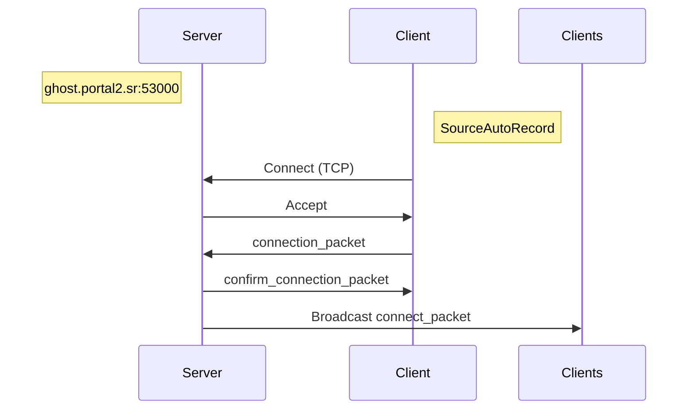
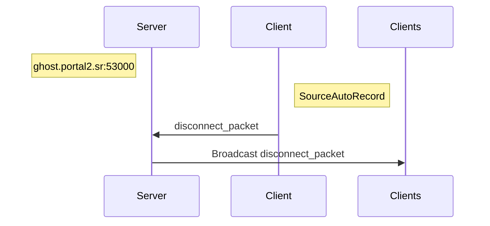
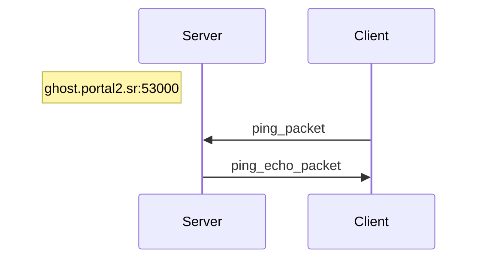

# ghosting

[GhostServer][p2sr-GhostServer] alternative for SourceAutoRecord.

[p2sr-GhostServer]: https://github.com/p2sr/GhostServer

- [Status](#status)
- [Protocol](#protocol)
  - [Connect](#connect)
    - [connection_packet](#connection_packet)
    - [confirm_connection_packet](#confirm_connection_packet)
  - [Disconnect](#connect)
    - [disconnect_packet](#disconnect_packet)
  - [Ping](#ping)
    - [ping_packet](#ping_packet)
    - [ping_echo_packet](#ping_echo_packet)
- [Enums](#enums)
  - [HEADER](#header)
- [Structs](#structs)
  - [GhostEntity](#ghostentity)
  - [Color](#color)
  - [Vector](#vector)
  - [DataGhost](#dataghost)
- [License](#license)

## Status

### TODO

- [x] Ping
- [x] Connect
- [x] Disconnect
- [ ] Stop Server
- [ ] Map Change
- [ ] Heart Beat
- [ ] Message
- [ ] Countdown
- [ ] Update
- [ ] Speedrun Finish
- [ ] Model Change
- [ ] Color Change

### Notes

- ID is not a unique identifier
- Header value gets ignored when starting a connection
- `STOP_SERVER` is also implemented client-side
- Disconnect is checked by IP

## Protocol

| Name                      | Value |
| ------------------------- | ----- |
| NONE                      | 0     |
| [PING](#ping)             | 1     |
| [CONNECT](#connect)       | 2     |
| [DISCONNECT](#disconnect) | 3     |
| STOP_SERVER               | 4     |
| MAP_CHANGE                | 5     |
| HEART_BEAT                | 6     |
| MESSAGE                   | 7     |
| COUNTDOWN                 | 8     |
| UPDATE                    | 9     |
| SPEEDRUN_FINISH           | 10    |
| MODEL_CHANGE              | 11    |
| COLOR_CHANGE              | 12    |

### Connect

#### connection_packet

| Field             | Type                    | Description |
| ----------------- | ----------------------- | ----------- |
| [header](#header) | u32                     |             |
| port              | u32                     |             |
| name              | CString                 |             |
| data              | [DataGhost](#dataghost) |             |
| model_name        | CString                 |             |
| level_name        | CString                 |             |
| tcp_only          | bool                    |             |
| color             | [Color](#color)         |             |
| spectator         | bool                    |             |

#### confirm_connection_packet

| Field     | Type                           | Description |
| --------- | ------------------------------ | ----------- |
| id        | u32                            |             |
| nb_ghosts | u32                            |             |
| ghosts    | [GhostEntity[]](#ghost-entity) |             |

#### connect_packet

| Field             | Type                    | Description |
| ----------------- | ----------------------- | ----------- |
| [header](#header) | u32                     | `CONNECT`   |
| id                | u32                     |             |
| name              | CString                 |             |
| data              | [DataGhost](#dataghost) |             |
| model_name        | CString                 |             |
| level_name        | CString                 |             |
| tcp_only          | bool                    |             |
| color             | [Color](#color)         |             |
| spectator         | bool                    |             |

### Disconnect

#### disconnect_packet

| Field             | Type | Description  |
| ----------------- | ---- | ------------ |
| [header](#header) | u32  | `DISCONNECT` |
| id                | u32  |              |

### Ping

#### ping_packet

| Field             | Type | Description |
| ----------------- | ---- | ----------- |
| [header](#header) | u32  | `PING`      |
| id                | u32  |             |

#### ping_echo_packet

| Field             | Type | Description |
| ----------------- | ---- | ----------- |
| [header](#header) | u32  | `PING`      |

## Structs

### GhostEntity

| Field       | Type                    | Description |
| ----------- | ----------------------- | ----------- |
| id          | u32                     |             |
| name        | CString                 |             |
| data        | [DataGhost](#dataghost) |             |
| model_name  | CString                 |             |
| current_map | CString                 |             |
| color       | [Color](#color)         |             |
| spectator   | bool                    |             |

### Color

| Field | Type | Description |
| ----- | ---- | ----------- |
| r     | u32  |             |
| g     | u32  |             |
| b     | u32  |             |

### Vector

| Field | Type | Description |
| ----- | ---- | ----------- |
| x     | f32  |             |
| y     | f32  |             |
| z     | f32  |             |

### DataGhost

| Field       | Type              | Description |
| ----------- | ----------------- | ----------- |
| position    | [Vector](#vector) |             |
| view_angle  | [Vector](#vector) |             |
| view_offset | u32               |             |
| grounded    | bool              |             |

## License

[MIT License](./LICENSE)
