# ghosting

[GhostServer][p2sr-GhostServer] alternative for SourceAutoRecord.

[p2sr-GhostServer]: https://github.com/p2sr/GhostServer

- [Status](#status)
- [Development](#development)
  - [Requirements](#requirements)
  - [Steps](#steps)
  - [Config](#config)
- [Production](#production)
- [Plugins (TODO)](#plugins-todo)
- [Protocol](#protocol)
  - [Packets](#packets)
  - [Header](#header)
  - [Structs](#structs)
- [License](#license)

## Status

### TODO

- [x] Protocol
  - [x] Ping
  - [x] Connect
  - [x] Disconnect
  - [x] Stop Server (not supported)
  - [x] Map Change
  - [x] Heart Beat
  - [x] Message
  - [x] Countdown
  - [x] Update
  - [x] Speedrun Finish
  - [x] Model Change
  - [x] Color Change
- [x] TCP/UDP mode
- [x] Implement old server commands
  - [x] exit
  - [x] help
  - [x] list
  - [x] countdown_set
  - [x] countdown
  - [x] disconnect
  - [x] disconnect_id
  - [x] ban
  - [x] ban_id
  - [x] accept_players
  - [x] refuse_players
  - [x] accept_spectators
  - [x] refuse_spectators
  - [x] server_msg
- [x] Deployment
  - [x] CI
  - [x] Docker image
  - [x] ghosting.portal2.sr
- [ ] Testing
  - [x] Client + GhostServer
  - [x] Server + SourceAutoRecord
  - [ ] Test on prod server
- [ ] Server as API/library
  - [ ] Plugin system
  - [ ] Server-side hooks
  - [ ] Publish package
  - [ ] Examples

### Discoveries

- ID is not a unique identifier
- `STOP_SERVER` packet is a kill switch
- `SPEEDRUN_FINISH` formats and sends the timer value as a string
- Disconnect is checked by IP
- Header value gets ignored when starting a connection
- "Heart Beat" should be called "Heartbeat"
- `CMD_SERVER_MSG` (CLI) does not schedule on server thread

### Wishlist

- Secure protocol
- Authentication
- Role system (via plugins)
- Server plugins (on TODO list)
- SSR?
- Client-side scripting?

## Development

### Requirements

- [Deno runtime](https://deno.com)

### Steps

- Start the server with:
  - `deno task start` with CLI
  - `deno task server` without CLI
- Connect to the server with:
  - `ghost_connect 0.0.0.0` with SAR
  - `deno task client --name Player` without SAR

### Config

Config file is called: `config.toml`

```toml
[server]
hostname = "127.0.0.1"
port = 53000

[logging]
level = "debug" # debug, info, warn, error, critical
console = true # might want to turn it off in CLI mode
file = true
filename = "logs/server.log"

[countdown]
delay = 0
pre_commands = ""
post_commands = ""
```

## Production

It's recommended to use [Docker Engine](https://docs.docker.com/engine/install). The latest server image is on
[Docker Hub](https://hub.docker.com/r/p2sr/ghosting/tags).

- Create [config.toml](#config)
- Create `logs` folder
- Create `docker-compose.yml` (see below)
- Run `docker compose up -d`

```yml
version: "3.8"
services:
  server:
    image: p2sr/ghosting:latest
    container_name: "ghosting"
    restart: always
    ports:
      - "127.0.0.1:53000:53000"
    volumes:
      - ./logs:/logs:rw
      - ./config.toml:/config.toml:rw
```

## Plugins (TODO)

This project also comes with a package that allows developers to write server plugins.

> [!WARNING]
> WIP. Subject to change.

```ts
import {
  command,
  IClient,
  on,
  Plugin,
  ServerEvent,
} from 'jsr:@p2sr/ghosting';

export class ExamplePlugin extends Plugin {
  name = 'Example Plugin';
  version = '1.0.0';
  authors = ['NeKz'];
  license = 'MIT';

  @command('ping', 'Ping the server!')
  async onPing() {
    await this.respond('pong!');
  }

  @command('dm <player> <message...>', 'DM a player!')
  async onDirectMessage(
    client: IClient,
    message: string,
  ) {
    await this.respondToClient(client, message);
  }

  @on(ServerEvent.ClientMessage)
  async onClientMessage(message: string) {
    // Use own command handler
    const [command, ..._rest] = message.split(' ');

    switch (command) {
      case '/ping': {
        await this.respond('pong');
        break;
      }
      case '/dm': {
        // ...
        break;
      }
    }
  }
}
```

## Protocol

### Endianness

SourceAutoRecord uses [SFML][sfml] which encodes integer types like `u16`, `u32`, `u64` in big-endian (BE).

[sfml]: https://www.sfml-dev.org

### Packets

This is the encoded representation of [sf::Packet][sf-packet] from SFML. Every TCP packet includes a field for the total
length of the data.

[sf-packet]: https://www.sfml-dev.org/documentation/2.6.1/classsf_1_1Packet.php

| Field  | Type            | Description                       |
| ------ | --------------- | --------------------------------- |
| length | u32             | TCP only! Length of `data` field. |
| data   | Header + Packet | Packet of type Connect, Ping etc. |

### Header

The header value (`u8`) defines the type of the packet. Since UDP is optional for clients the implementation is only
required for `HEART_BEAT`, `COUNTDOWN` and `UPDATE` packets.

| Name                                | Value | TCP | UDP |
| ----------------------------------- | ----- | --- | --- |
| NONE                                | 0     | ✅️  |     |
| [PING](#ping)                       | 1     | ✅️  |     |
| [CONNECT](#connect)                 | 2     | ✅️  |     |
| [DISCONNECT](#disconnect)           | 3     | ✅️  |     |
| STOP_SERVER                         | 4     | ✅️  |     |
| [MAP_CHANGE](#map-change)           | 5     | ✅️  |     |
| [HEART_BEAT](#heart-beat)           | 6     | ✅️  | ✅️  |
| [MESSAGE](#message)                 | 7     | ✅️  |     |
| [COUNTDOWN](#countdown)             | 8     | ✅️  | ✅️  |
| [UPDATE](#update)                   | 9     | ✅️  | ✅️  |
| [SPEEDRUN_FINISH](#speedrun-finish) | 10    | ✅️  |     |
| [MODEL_CHANGE](#model-change)       | 11    | ✅️  |     |
| [COLOR_CHANGE](#color-change)       | 12    | ✅️  |     |

### Connect

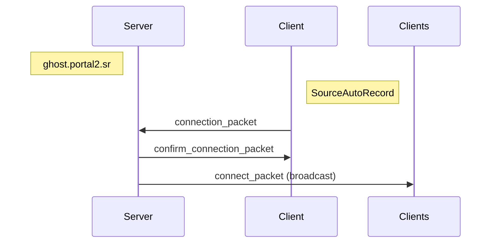

#### connection_packet

| Field             | Type                      | Description |
| ----------------- | ------------------------- | ----------- |
| [header](#header) | u8                        | `CONNECT`   |
| port              | u16                       |             |
| name              | [std::string](#stdstring) |             |
| data              | [DataGhost](#dataghost)   |             |
| model_name        | [std::string](#stdstring) |             |
| level_name        | [std::string](#stdstring) |             |
| tcp_only          | bool                      |             |
| color             | [Color](#color)           |             |
| spectator         | bool                      |             |

#### confirm_connection_packet

Note: This packet does not have a header. It is handled immediately after the connection_packet.

| Field     | Type                                    | Description |
| --------- | --------------------------------------- | ----------- |
| id        | u32                                     |             |
| nb_ghosts | u32                                     |             |
| ghosts    | [GhostEntity[nb_ghosts]](#ghost-entity) |             |

#### connect_packet

| Field             | Type                      | Description |
| ----------------- | ------------------------- | ----------- |
| [header](#header) | u8                        | `CONNECT`   |
| id                | u32                       |             |
| name              | [std::string](#stdstring) |             |
| data              | [DataGhost](#dataghost)   |             |
| model_name        | [std::string](#stdstring) |             |
| level_name        | [std::string](#stdstring) |             |
| tcp_only          | bool                      |             |
| color             | [Color](#color)           |             |
| spectator         | bool                      |             |

### Disconnect

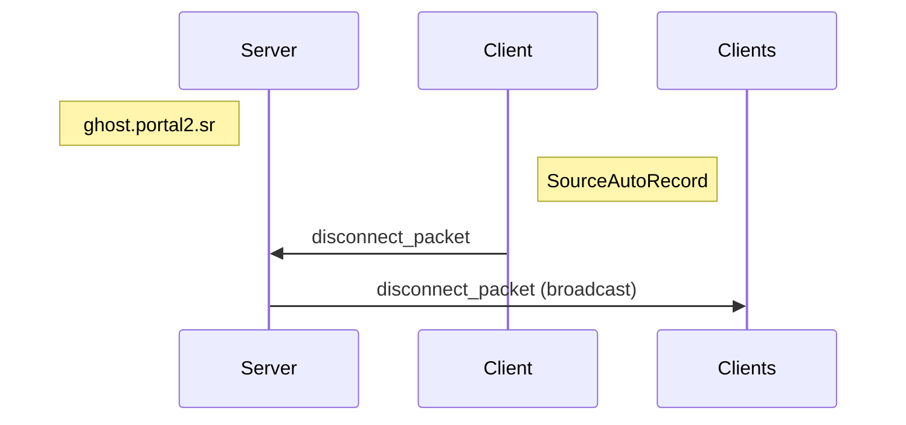

#### disconnect_packet

| Field             | Type | Description  |
| ----------------- | ---- | ------------ |
| [header](#header) | u8   | `DISCONNECT` |
| id                | u32  |              |

### Ping

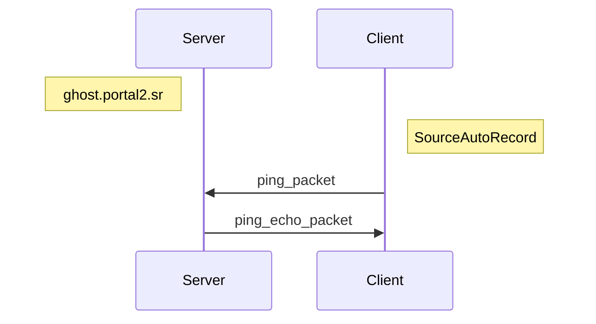

#### ping_packet

| Field             | Type | Description |
| ----------------- | ---- | ----------- |
| [header](#header) | u8   | `PING`      |
| id                | u32  |             |

#### ping_echo_packet

| Field             | Type | Description |
| ----------------- | ---- | ----------- |
| [header](#header) | u8   | `PING`      |

### Map Change


#### map_change_packet

| Field             | Type                      | Description  |
| ----------------- | ------------------------- | ------------ |
| [header](#header) | u8                        | `MAP_CHANGE` |
| id                | u32                       |              |
| map_name          | [std::string](#stdstring) |              |
| ticks             | u32                       |              |
| tick_total        | u32                       |              |

### Heart Beat

#### TCP

Two missed heartbeats will mark a client as disconnected.

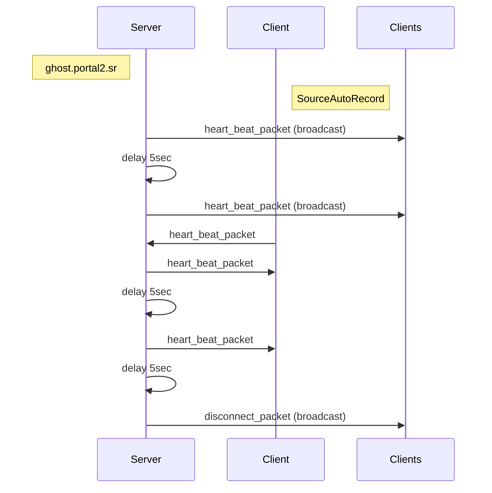

#### UPD

Used to keep connection alive.

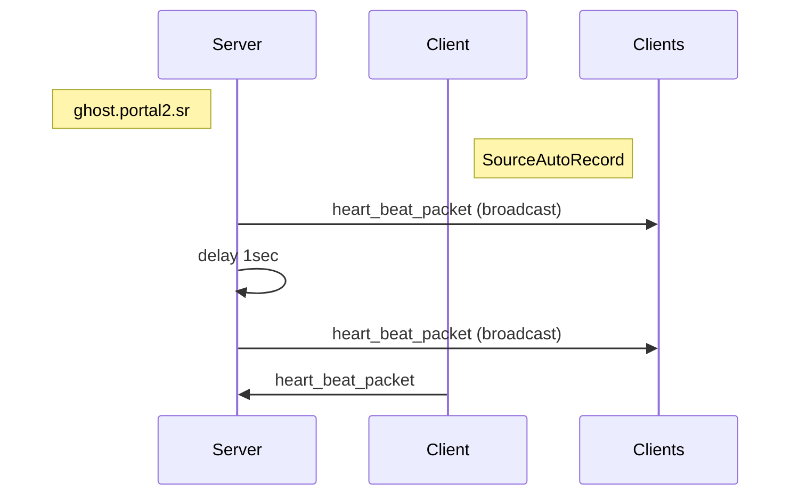

#### heart_beat_packet

| Field             | Type | Description     |
| ----------------- | ---- | --------------- |
| [header](#header) | u8   | `HEART_BEAT`    |
| id                | u32  | Server sends 0  |
| token             | u32  | UDP is always 0 |

### Message

#### Client Message

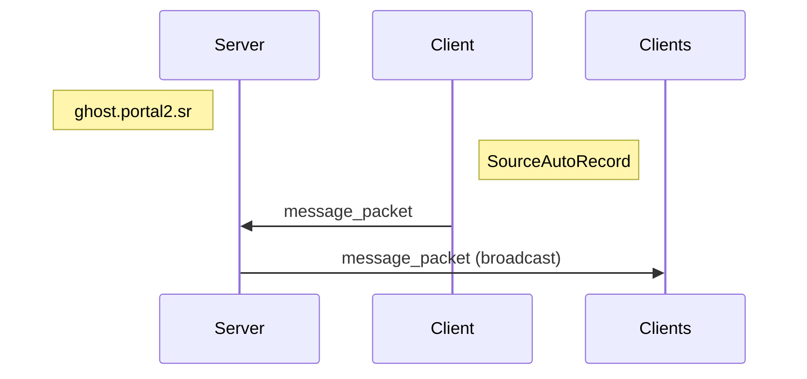

#### Server Message

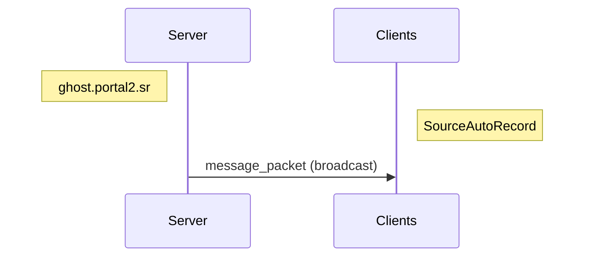

#### message_packet

| Field             | Type                      | Description         |
| ----------------- | ------------------------- | ------------------- |
| [header](#header) | u8                        | `MESSAGE`           |
| id                | u32                       | 0 if Server Message |
| message           | [std::string](#stdstring) |                     |

### Countdown

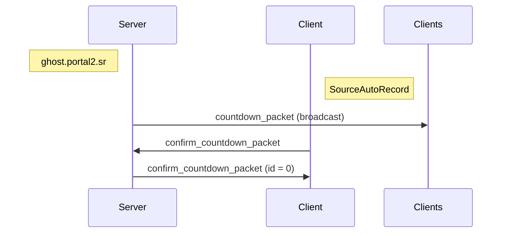

#### countdown_packet

| Field             | Type                      | Description |
| ----------------- | ------------------------- | ----------- |
| [header](#header) | u8                        | `COUNTDOWN` |
| id                | u32                       | 0           |
| step              | u32                       | 0           |
| duration          | u32                       |             |
| pre_commands      | [std::string](#stdstring) |             |
| post_commands     | [std::string](#stdstring) |             |

#### confirm_countdown_packet

| Field             | Type | Description    |
| ----------------- | ---- | -------------- |
| [header](#header) | u8   | `COUNTDOWN`    |
| id                | u32  | Server sends 0 |
| step              | u32  | 1              |

### Update

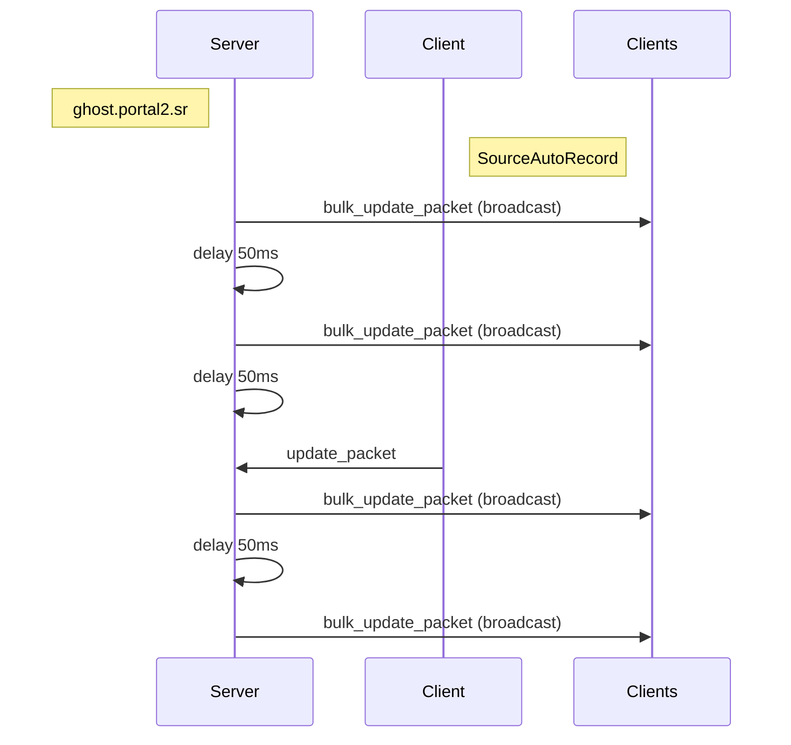

#### bulk_update_packet

| Field             | Type                                  | Description |
| ----------------- | ------------------------------------- | ----------- |
| [header](#header) | u8                                    | `UPDATE`    |
| id                | u32                                   | 0           |
| count             | u32                                   |             |
| update            | [DataGhostUpdate](#dataghostupdate)[] |             |

#### update_packet

| Field             | Type                    | Description |
| ----------------- | ----------------------- | ----------- |
| [header](#header) | u8                      | `UPDATE`    |
| id                | u32                     |             |
| data              | [DataGhost](#dataghost) |             |

### Speedrun Finish


#### speedrun_finish_packet

| Field             | Type                      | Description       |
| ----------------- | ------------------------- | ----------------- |
| [header](#header) | u8                        | `SPEEDRUN_FINISH` |
| id                | u32                       |                   |
| time              | [std::string](#stdstring) |                   |

### Model Change

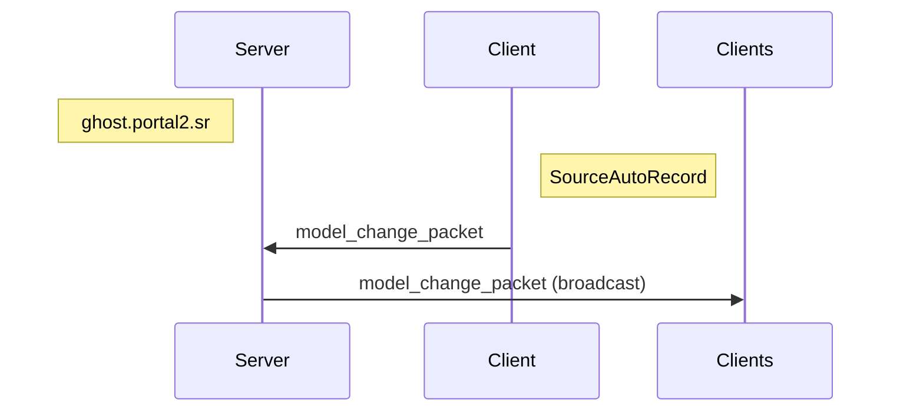

#### model_change_packet

| Field             | Type                      | Description    |
| ----------------- | ------------------------- | -------------- |
| [header](#header) | u8                        | `MODEL_CHANGE` |
| id                | u32                       |                |
| model_name        | [std::string](#stdstring) |                |

### Color Change

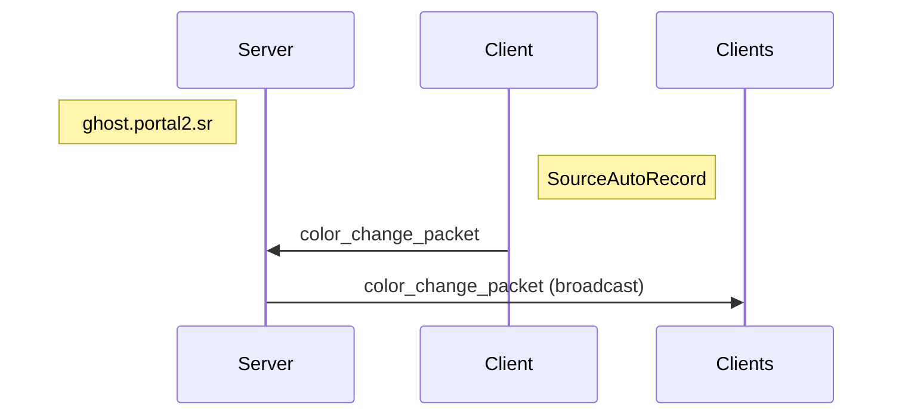

#### color_change_packet

| Field             | Type            | Description    |
| ----------------- | --------------- | -------------- |
| [header](#header) | u8              | `COLOR_CHANGE` |
| id                | u32             |                |
| color             | [Color](#color) |                |

### Structs

#### std::string

| Field  | Type           | Description |
| ------ | -------------- | ----------- |
| length | u32            |             |
| value  | char\[length\] |             |

#### GhostEntity

| Field       | Type                      | Description |
| ----------- | ------------------------- | ----------- |
| id          | u32                       |             |
| name        | [std::string](#stdstring) |             |
| data        | [DataGhost](#dataghost)   |             |
| model_name  | [std::string](#stdstring) |             |
| current_map | [std::string](#stdstring) |             |
| color       | [Color](#color)           |             |
| spectator   | bool                      |             |

#### Color

| Field | Type | Description |
| ----- | ---- | ----------- |
| r     | u8   |             |
| g     | u8   |             |
| b     | u8   |             |

#### Vector

| Field | Type | Description |
| ----- | ---- | ----------- |
| x     | f32  |             |
| y     | f32  |             |
| z     | f32  |             |

#### QAngle

| Field | Type | Description |
| ----- | ---- | ----------- |
| x     | f32  |             |
| y     | f32  |             |
| z     | f32  |             |

#### DataGhost

| Field      | Type              | Description                |
| ---------- | ----------------- | -------------------------- |
| position   | [Vector](#vector) |                            |
| view_angle | [QAngle](#qangle) |                            |
| data       | u8                | Encoded fields, see below. |

##### Data

| Field       | Type | Description                |
| ----------- | ---- | -------------------------- |
| view_offset | f32  | `data & 0x7F` (bit 1 to 7) |
| grounded    | bool | `data & 0x80` (bit 8)      |

#### DataGhostUpdate

| Field | Type                     | Description |
| ----- | ------------------------ | ----------- |
| id    | u32                      |             |
| data  | [DataGhost](#dataghost#) |             |

## License

[MIT License](./LICENSE)
