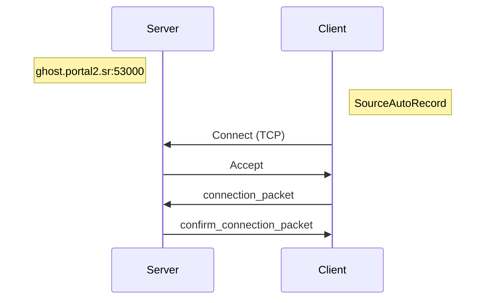

# ghosting

[GhostServer][p2sr-GhostServer] alternative for SourceAutoRecord.

[p2sr-GhostServer]: https://github.com/p2sr/GhostServer

- [Status](#status)
- [Protocol](#protocol)
  - [Connect](#connect)
- [Packets](#packets)
  - [connection_packet](#connection_packet)
  - [confirm_connection_packet](#confirm_connection_packet)
- [Enums](#enums)
  - [HEADER](#header)
- [Structs](#structs)
  - [GhostEntity](#ghostentity)
  - [Color](#color)
  - [Vector](#vector)
  - [DataGhost](#dataghost)
- [License](#license)

## Status

- [ ] Ping
- [x] Connect
- [ ] Disconnect
- [ ] Stop Server
- [ ] Map Change
- [ ] Heart Beat
- [ ] Message
- [ ] Countdown
- [ ] Update
- [ ] Speedrun Finish
- [ ] Model Change
- [ ] Color Change

## Protocol

### Connect

## Packets

### connection_packet

|                   |                         |
| ----------------- | ----------------------- |
| [header](#header) | u32                     |
| port              | u32                     |
| name              | CString                 |
| data              | [DataGhost](#dataghost) |
| model_name        | CString                 |
| level_name        | CString                 |
| tcp_only          | bool                    |
| color             | [Color](#color)         |
| spectator         | bool                    |

### confirm_connection_packet

|           |                                |
| --------- | ------------------------------ |
| nb_ghosts | u32                            |
| ghosts    | [GhostEntity[]](#ghost-entity) |

## Enums

### HEADER

|                 |    |
| --------------- | -- |
| NONE            | 0  |
| PING            | 1  |
| CONNECT         | 2  |
| DISCONNECT      | 3  |
| STOP_SERVER     | 4  |
| MAP_CHANGE      | 5  |
| HEART_BEAT      | 6  |
| MESSAGE         | 7  |
| COUNTDOWN       | 8  |
| UPDATE          | 9  |
| SPEEDRUN_FINISH | 10 |
| MODEL_CHANGE    | 11 |
| COLOR_CHANGE    | 12 |

## Structs

### GhostEntity

|             |                         |
| ----------- | ----------------------- |
| id          | u32                     |
| name        | CString                 |
| data        | [DataGhost](#dataghost) |
| model_name  | CString                 |
| current_map | CString                 |
| color       | [Color](#color)         |
| spectator   | bool                    |

### Color

|   |     |
| - | --- |
| r | u32 |
| g | u32 |
| b | u32 |

### Vector

|   |     |
| - | --- |
| x | f32 |
| y | f32 |
| z | f32 |

### DataGhost

|             |                   |
| ----------- | ----------------- |
| position    | [Vector](#vector) |
| view_angle  | [Vector](#vector) |
| view_offset | u32               |
| grounded    | bool              |

## License

[MIT License](./LICENSE)
